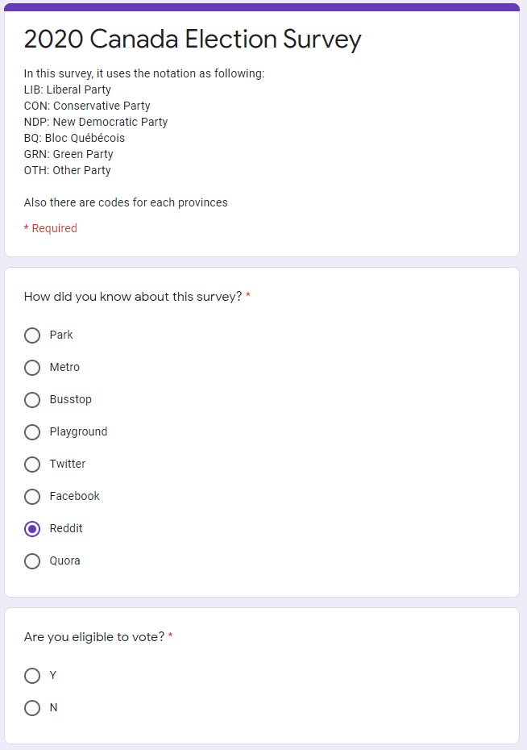

```{r setup, include=FALSE}
knitr::opts_chunk$set(echo = TRUE)
```

## Executive Summary

Nearly all political action committees, city council members, political consultants, school board districts, government agencies, rely on offline or online surveys to get the insights they need to drive their causes and run quick polls on hot-button issues. 

The importance of investigation is self-evident, and a good polling update of investigation must not only reflect the reality, but also help political parties adjust the focus of their campaign activities and achieve more election goals within a limited budget.

Throughout the report, I was employed by the Conservative Party to complete the following tasks:

1. Based on the entire election environment, analyze the significance of the research report and promote it to a wide range of application scenarios, which can help customers understand the significance of the survey;

2. Design the questionnaire based on the survey method and put it to the target people in different forms, which will help the survey designer to obtain data;

3. Data analysis based on the simulation results, which can verify the correctness of the method;

4. Discuss possible biases and errors in the questionnaire and study how they affect the results of the survey, which will show us the things behind the election;

5. Display the methods and references used in the entire report in the report.

## Introduction

The whole polling status updating is a survey of how I conduct this research to help our client, that is, the Conservative.

Focusing on present^1^, the Liberals hold a comfortable lead in Atlantic Canada and are ahead of the Conservatives in British Columbia. Two-thirds of the Liberals' seat advantage nationwide is due to Ontario, where the party has a lead over the Conservatives. The Liberals are also narrowly in front of the Bloc in Quebec. The Conservatives are solidly in first in Alberta and the Prairies. Both the NDP and the Greens have their strongest results in B.C.

When designing the questions and conducting the survey, all the work should be put into certain context. We can use survey to identify supporters for campaign, gather feedback from constituents, organize rallies(or potential rallies), get feedback of present political event, help the winning local election.

Also the code for this post is in the Git Repo: https://github.com/Craymate/Survey-Election

## Survey Methodology

When employed by certain political party, writing clear and neutral survey questions is not easy like it seems. There's more survey methodology to demystify when conducting our research, and the question wording is important too.

### Survey Objections

The object of the survey is:

1. To find out the main supporters and get contact.

2. To get feedback of different local districts and find their focal point including what they want to keep most and what they want to change most.

3. To find room to increase votes and help make real-time adjustments to policies.

### Sample Frames and Methodology

1. This survey aims at all civilizations in Canada, so we can get information from all districts and use differences between districts to help political parties make customized decisions.

2. This survey use online and offline survey methods are used to distribute questionnaires in public places with equal probability and random sampling, which is usually called Simple
Random Sampling Without Replacement (SRSWOR)^2^, and the questionnaires are distributed on the Internet using a neutral platform.

### Relevant Data Colletion

In the process of designing the questionnaire, it is necessary to design "irrelevant questions" that are different from the target question to help the data analyst classify the sample, or analyze whether the collected sample is valid. This often includes:

1. Gender and age (or even occupation), data analysts usually need to ensure that the questionnaire is distributed to all types of people.

2. Simple daily questions. When questionnaire collectors find that subjects have abnormal answers to such questions, they can usually screen out invalid questionnaires during the result entry process.

### Accuracy Estimation

The parameter estimates obtained by sampling are usually biased. Part of this bias comes from the cognitive bias of the subjects on the same question, and part comes from the bias in the questionnaire design. In particular:

1. The position of the questionnaire designer will affect the design of the questionnaire and lead to deviations;

2. The order of the questions may induce participants to answer an important question from a certain angle (what the questionnaire designer hopes to get). In this way, using prejudice to induce participants to answer will often get "good" results but cannot affect the votes of neutrals in the long term, because they are also susceptible to other information interference. At the same time, it will also cause the political parties to produce miscalculations on the situation and thus formulate wrong campaign strategies.

### Reach Respondents and Dealing with Non-response

In fact, dealing with Non-responses is the same thing as finding the target respondents.  The length of the questionnaire (number of questions), the text layout of the question, and even the environment under which the survey is conducted will affect the quality of the questionnaire, which increases the probability of Non-responses and reduces the probability of obtaining target information.

In the Internet space, in order to obtain higher-quality sample information, the usual methods are to select groups or individuals that they trust to conduct surveys, or to issue questionnaires on platforms that they are familiar with daily. But usually this approach has strong prejudices. For example, we know that the in-depth users of different social platforms often have very big differences in group characteristics from the “popular” we want to investigate, and the similarity between relatives and friends is even greater. It violates the principle of medium probability of the interviewee in the entire target group.

To sum up, in order to ensure the unbiased and effective sampling, we choose to put the number of questionnaires based on the proportion of users on different social software, and choose different public places to put questionnaires commensurate with the proportion of people flow, which use the stratified sampling method.

### Cost estimation

Regardless of whether it is filled online or offline, we will give participants an incentive ranging from $1-100 (the higher the bonus, the lower the probability of obtaining), and the dairy products of brand A (virtual brand) or B Daily cleaning appliances of the brand (virtual brand) are given as incentives to raise sponsorship as the funding for this survey. After conversion, it can be considered that there is no actual net expenditure in this survey.

### Privacy Protection

Sometimes researchers are confused about how to determine what information is private. Subject’s privacy protection is an important means and ethical requirement for obtaining target information, and behaviors that respect privacy often bring more votes and favors to political parties (except for individuals who advocate that the government should obtain more citizens' information).

## Survey Design

### Motivation

Our client, the Conservative, is left behind the election polling. After the selection of our new leader, we got a small bump but that is not enough. We need to ensure that the Liberals won't get majority seats and fight for potential leading.

Based on the above methodology and basic guidelines that need to be paid attention to, I designed the following questionnaire:

### Fundamental Question

(@) How did you know about this survey?(Written by Questionnaire Collector)

(@) Are you eligible to vote?(choose Y or N)

(@) Which province are you located?(Use province code and option not to say)

(@) What is your gender?(Open question)

(@) How old are you?(Open question)

### Trap question(Validity Checking)

(@) In this question, please choose A(Give choices of A and B)

(@) In this question, please choose F(Give choices of T and F)

### Current Hotspot Affairs

(@) Do you think it is necessary to further strengthen or maintain the control of public areas such as bars?(Give choices of Yes and No)

(@) Do you think it is necessary to further postpone the opening of school?(Give choices of Yes and No)

(@) Do you think it is necessary to increase the minimum monthly income limit in CRB?(Give choices of Yes and No)

(@) Score from 1 to 10, how do you think the government should balance the promotion of vaccine trials and safety tests (the larger the value, the more important the safety test is)

(@) On a scale from 1 to 10, how do you think the government should make trade-offs between promoting the resumption of work and production and restricting production to ensure safety (the bigger the representative, the more hopeful it is to resume working)

### Political orientation issues

(@) At present, which party would you vote?(Give choices and option not to say)

(@) Which party you think will win the election?(Give choices)

(@) Which party you think will get majority seats?(Give choices)

## Simulating

In this part, I generated 10,000 questionnaires after screening, which means that there are no vacancies in the sample data that answered the trap questions correctly. In issues that are not related to political bias, the data generated is as even as possible.

```{r}
n=1e4
set.seed(1)
dat <- data.frame(
  platform=rep(c('Park','Metro','Busstop','Playground','Twitter','Facebook','Reddit','Quora'),125),
  eligible=rep('Y',n),
  province=c(rep(c('ON','QC','PE','BC','NB','NS','MB','NL','SK','AB','YT','NT','NU'),769),rep('prefer_not_say',3)),
  gender=rep(c('M','F'),5000),
  age=sample(20:60,10000,replace = T),
  trapa=rep('A',1e4),
  trapf=rep('F',1e4),
  pub_ctrl=sample(c('Y','N'),10000,replace = T,prob = c(0.3,0.7)),
  sch_open=sample(c('Y','N'),10000,replace = T,prob = c(0.35,0.65)),
  min_inc=sample(c('Y','N'),10000,replace = T,prob = c(0.8,0.2)),
  balance1 = as.integer(rnorm(10000,5.5,1)),
  balance2 = as.integer(rnorm(10000,5.5,1.2)),
  vote = sample(c('LIB','CON','NDP','BQ','GRN','OTH'),10000,replace = T,prob = c(0.364,0.309,0.173,0.067,0.061,0.026)),
  win = sample(c('LIB','CON','NDP'),10000,replace = T,prob = c(0.6,0.3,0.1)),
  majority = sample(c('LIB','CON'),10000,replace = T,prob = c(0.85,0.15)),
  stringsAsFactors = T
)

```

and we can get our simulated data frame in an ideal state.


## Results

Although the result comes from simulating, we should know what matters is the method of analysis, not the result of a particular survey.

### Fundamental Summary

First we can view the basic information of the data set generated by the simulation:

```{r}
# show structure
str(dat)

# brief summary
summary(dat)
```

### Exploratory Analysis

Using the fundamental information of survey results, it's not intuitive for our clients. So we hope to reflect the exact relationship through quantitative expression, in this section, we are trying to find out if the two numeric `balance` answers can influence each other.

```{r}
# correlation statistics
cor(dat$balance1, dat$balance2)

# linear regression
linear.model1 <- lm(balance1 ~ balance2,
                    data = dat)
summary(linear.model1)

```

From the statistics and also the summary, it's significant that there's no linear correlation between this two variables. This result comes from our simulation, so of course nothing will be discovered. But in some circumstances, some kind of linear dependence exists between two numeric variables, and our clients can use such model to develop or modify policies.

Moreover, there are more `factor` variables we need to analyze. And what we do next is to test whether the means of the two types of samples are the same.

To be precise, we want to do a hypothesis test, that is, whether people of different genders will make the same level in the first balancing decision (here we are based on the estimation method of statistics in sampling theory, and we believe that the mean can reflect unbiasedly Average) decision-making.

So our original hypothesis is: Different genders have the same level of response to the first type of balanced decision-making. In contrast, the alternative hypothesis is that different genders have different levels of response to the first type of balanced decision-making.

```{r}
a <- dat$balance1[which(dat$gender=='M')]
b <- dat$balance1[which(dat$gender=='F')]

t.test(a,b)
```

After testing, we found that the two groups of people did have the same decision-making level in the first balanced decision. That is, after testing, according to the statistics and p-value, the mean values of the two numerical variables are the same, so here we accept the null hypothesis and consider that they are different The genders have the same level of response to the first type of balanced decision-making.

Indeed, this result is produced because the result data set is generated by our use of the program, rather than a response to the real situation. But at the same time we need to know that different groups of people, especially groups with large differences in group characteristics, usually have different levels of group responses when facing problems, and political parties (or other customers) need to use this group difference to obtain specific groups. Stable support, and to a greater extent strive for the favor of opposing groups to prevent them from falling to competitors.


### Visual analysis method

The intuitive feeling comes from the persuasive chart. Below we tried different methods to try to characterize the result data:

#### Preparing
```{r, warning=FALSE}
# load packages
library(ggplot2)
library(plyr)
library(olsrr)
```

#### Bar plot

When we look at the distribution of platform, we can use `table` to generate result like this:
```{r}
table(dat$platform)
```

And we are going to visualize it like Figure 1 below:

```{r}
num <- as.numeric(table(dat$platform))
names <- names(table(dat$platform))
df <- data.frame(num=num,names=names)

ggplot(df, aes(x=names, y=num, fill=names)) +
  geom_bar(stat="identity")+theme_minimal() +
  ggtitle('Figure 1: Sample Distribution of Platform')
```

#### Density Plot

Studying the density distribution of two types of numerical samples can compare the differences between the two types of samples at the same level, and through the method of combination graphs, this comparison is more intuitive:

```{r}
# calculate mean
mu <- ddply(dat, "gender", summarise, grp.mean=mean(balance1))
# density plot
ggplot(dat, aes(x=balance1, color=gender)) +
  geom_density()+
  geom_vline(data=mu, aes(xintercept=grp.mean, color=gender),
             linetype="dashed")+
  ggtitle('Figure 2: Density Plot of the first balance vote between genders')
```

Since we used simulated data for verification, we can find in Figure 2 that the two genders are the same on the image. But by observing the fineness of the image, it can be found that the density map is indeed an excellent visualization method.

#### Boxplot

In addition to the density map that can reflect the overall nature, we can also use box plots that can reflect the overall value distribution to depict the performance of different variables or different individuals of the same variable:

##### Different Variables

If we want to know the difference between the results of two balanced votes, we can use:

```{r}
df <- data.frame(votes = c(dat$balance1,dat$balance2),
                 tags = c(rep('V1',5e3),rep('V2',5e3)))

ggplot(df, aes(x=tags, y=votes, fill=tags)) +
  geom_boxplot() +
  ggtitle('Figure 3: Boxplot Comparison of Two Variables')
```
The result Figure 3 also reflects the similarity of the two simulation variables, which verifies the effectiveness of the method.


##### One Variable in Different Groups

If we want to know the difference between the results of two balanced groups, we can use:

```{r}

ggplot(dat, aes(x=win, y=balance1, fill=win)) +
  geom_boxplot() +
  ggtitle('Figure 4: Boxplot Comparison of Two Groups in Balance 1')
```
Same as before, the result Figure 4 also reflects the similarity of the simulation data of different groups.

#### Regression Plot

Different from the previous drawing, here we use the regression model established before for diagnosis, and use the diagnosis method in the `olsrr` package to draw all the diagnostic images together.

```{r}
ols_plot_diagnostics(linear.model1)
```

Looking at the figures, you can find that such a regression image can be more useful in real application scenarios.


## Discussion

1. In this sampling survey and simulation process, are there still errors or biases?

In such a sample survey, any form of prejudice and error are unavoidable.  For example: This simulation took an equal amount of samples on each social platform, but in fact, the number of active people on each platform is different and should be distributed in a certain proportion.  The same problem also appears in the sampling of public places. Of course, different public places have different numbers of active people.

The information collected does not fully reflect the real situation.  For example, due to factors such as incorrect filling or deliberate wrong filling, not all subjects who claim to be eligible to vote have the right to vote. This will also make it difficult to distinguish which samples are indeed valid. We can only obtain more information.  Samples and unbiased estimates based on sampling theory to obtain as accurate information as possible.

2. In this sampling survey and simulation process, how can we help customers(the Conservative) through the results?

Through the analysis of the results, we can indeed provide customers with a lot of substantive and actionable suggestions.  For example, the quantitative methods and hypothesis testing methods used in the "Results" section can determine the source of stable support for customers and the groups that need to be sought.  By changing the means of propaganda or the allocation of resources invested in elections, the swing votes of a particular electoral district can be significantly increased.  These are specific practical suggestions

In addition, the results of the survey can help customers understand the current situation and obtain more targeted results in further investigations.  Even if you don’t dig deeper and use the visualization methods of charts, you can intuitively show the results of the election to your partners, win more support for yourself, and create stronger propaganda capital.

3. In this sampling survey and simulation process, what kind of result can be considered good?

In the whole survey results, the authenticity and validity of the results are two very important parts.  According to sampling theory, a survey result is considered a good survey only when it is true and credible and contains more information.

First of all, ask yourself a question. Why is it not always a good thing to support the majority of the party stations where customers are in the survey results?  How do you prove that your results are credible when your survey results are very different from those done by others?

If you find friends who are close to your own ideas and conduct provocative investigations in a small area, the results will of course be very biased.  A good survey should not mislead or influence the concept of the surveyed, let alone select a specific group for the survey, which will run counter to the purpose of the survey.  The survey is a non-interference one-to-many exchange. It is a friendly exchange of information under the protection of respect and protection of the privacy of the other party. Only when the surveyed person is not selected outside the scope, the questionnaire should not be designed with inflammatory questions.  Only when we don’t restrict the investigation scene can we get closer to the original investigation goal.

## Reference

- https://newsinteractives.cbc.ca/elections/poll-tracker/canada/
- Wu & Thompson: Sampling Theory and Practice
- H. Wickham. ggplot2: Elegant Graphics for Data Analysis.
  Springer-Verlag New York, 2016.
- Hadley Wickham (2011). The Split-Apply-Combine Strategy for Data
  Analysis. Journal of Statistical Software, 40(1), 1-29. URL
  http://www.jstatsoft.org/v40/i01/.
- Aravind Hebbali (2020). olsrr: Tools for Building OLS Regression
  Models. R package version 0.5.3.
  https://CRAN.R-project.org/package=olsrr
  
## Appendices

Survey Link: https://docs.google.com/forms/d/e/1FAIpQLSfySY4VjWC50LSK8f1rAKDc723D3JU2Tkmr_fKuKL7Shlm0Rg/viewform?usp=sf_link



